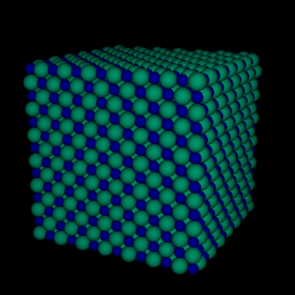

# minipunto

 A small and simple molecular dynamics visualisation tool for X, with
 exclusively standard dependencies.

## Molecular dynamics file format

The files should contain at least three columns
(x, y and z coordinates) but may include radii
and RGB colours in the fourth and fifth columns.
Comments, marked with a # at the  beginning of a
line, are ignored. Blank lines separate frames.

End files with (newline) #.

## Command-line options

| Option                             |     Parameter               |
|------------------------------------|-----------------------------|
| -b &lt;RGB integer&gt;             | Background colour.          |
| -t &lt;RGB integer&gt;             | Text colour.                |
| -L &lt;x value&gt;                 | Initial camera distance.    |
| -l &lt;x&gt; &lt;y&gt; &lt;z&gt;   | Initial location of camera. |
| -a &lt;x&gt; &lt;y&gt; &lt;z&gt;   | Camera aim.                 |
| -z &lt;x&gt; &lt;y&gt; &lt;z&gt;   | Camera zenith vector.       |

You can pipe data into minipunto, but it will not loop when it
reaches the end of the output.

## Interaction keys

|     Key        |     Action                                |
|----------------|-------------------------------------------|
| (Arrow keys)   | Rotate system.                            |
| +, -           | Zoom in, out.                             |
| w, s           | Forward, backwards.                       |
| a, d           | Turn left, right.                         |
| z, x           | Move sideways to the left, right.         |
| r, f           | Move up, down.                            |
| 1, 2           | Look up, down.                            |
| 3, 4           | Camera roll counter-clockwise, clockwise. |
| b              | Rewind data file.                         |
| p, (space bar) | Toggle pause on/off.                      |
| .              | Toggle fading on/off.                     |
| c              | Output camera information.                |
| o              | Take (ppm) screenshot.                    |
| 0              | Start/stop recording video.               |
| q, (escape)    | Quit program.                             |

## Screenshots and video recording

While minipunto is running, you can press o to take a screenshot,
which it saves as an image in ppm format, which you can read with
an image viewer like eog, or programs like gimp. You can also
convert it into some other format with the command
``convert -i 0.ppm screenshot.png``.

To record video, minipunto uses ``avconv``, but you can change
the reference to ``avconv`` in the code to ``ffmpeg`` instead
and it should still work fine. Another option is to compile
with a ``-DRAW_VIDEO_TO_FILE`` flag, which will save the video
as a ``.raw`` file.
